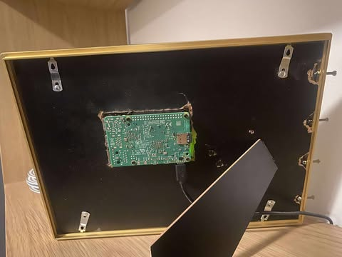

# inky-dashboard
A hobby project developed on a Raspberry Pi 5, designed to drive a 13.3" Inky Impression e-paper display. The dashboard integrates various data sources such as weather, Spotify, and calendar information, serving as a learning experience.

## Features

- Live weather updates
- Spotify playback info and controls
- Appliance usage tracking
- Calendar integration (Google Calendar)
- Bluetooth speaker controls
- HTTP for spotify jam QrCode
- Multiple display modes (customizable views)
- working rain gauge
- routines (Daniel mode on daniel days between hours 19-20, cooldown mode @ time and @ unless spotify is playing)

## Showcase

Here are some screenshots and demo videos of the Inky Dashboard in action!

### Photos

| Main Dashboard | Main Changes | Spotify HTTP | Spotify Jam |
|:--------------:|:-----------:|:------------:|:-----------:|
| .png) | .png) | .png) | .png) |

### In-Person Photos

| Front View | Back View |
|:----------:|:---------:|
|  |  |

### cooldown mode

| eavening reading | time to sleep |
|:----------:|:---------:|
|  |  |

### Videos

- **Spotify Controls Demo:**  
  [Watch spotify_controls.mp4](images/spotify_controls.mp4)

- **Switching from Spotify to Main Screen:**  
  [Watch spotify_to_main.mp4](images/spotify_to_main.mp4)

### Appliance Status Showcase

The dashboard visually tracks appliance usage over time. Here’s how the dishwasher icon changes depending on when it was last run or if it’s running:

| Running | Just Finished | 1+ Days Ago | 3+ Days Ago | 7+ Days Ago |
|:-------:|:-------------:|:-----------:|:-----------:|:-----------:|
|  |  |  |  |  |
| Running now | Finished today | 1–2 days ago | 3–6 days ago | 7+ days ago |

### Rain Gauge Status Showcase 

The dashboard also visualizes recent rainfall using a series of icons:

| Dry | Light Rain | Moderate Rain | Heavy Rain |
|:---:|:----------:|:-------------:|:----------:|
|  |  |  |  |
| No recent rain | Light rainfall | Moderate rainfall | Heavy rainfall |
