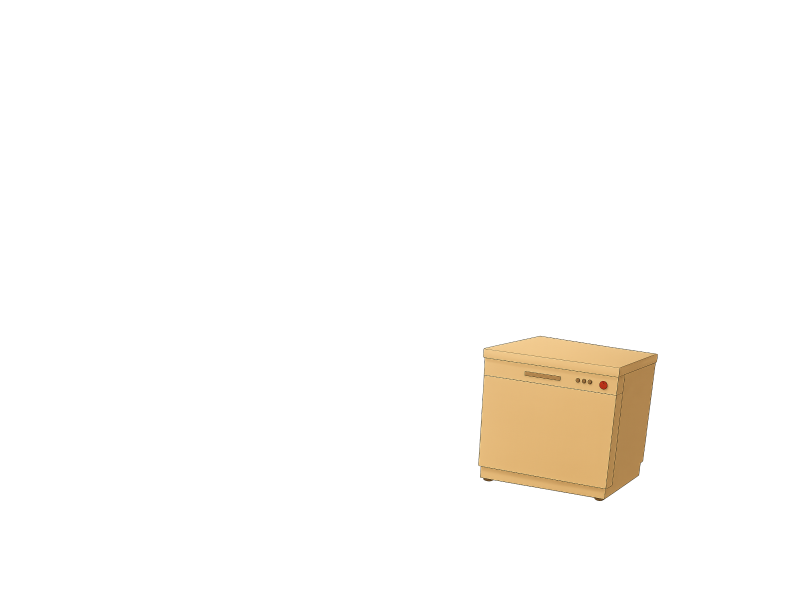

# inky-dashboard
A hobby project developed on a Raspberry Pi 5, designed to drive a 13.3" Inky Impression e-paper display. The dashboard integrates various data sources such as weather, Spotify, and calendar information, serving as a learning experience.

## Features

- Live weather updates
- Spotify playback info and controls
- Appliance usage tracking
- Calendar integration (Google Calendar)
- Bluetooth speaker status and controls
- HTTP API for data updates
- Multiple display modes (customizable views)
- working rain gauge

## Showcase

Here are some screenshots and demo videos of the Inky Dashboard in action!

### Photos

| Main Dashboard | Main Changes | Spotify HTTP | Spotify Jam |
|:--------------:|:-----------:|:------------:|:-----------:|
| .png) | .png) | .png) | .png) |

### In-Person Photos

| Front View | Back View |
|:----------:|:---------:|
|  |  |

### Videos

- **Spotify Controls Demo:**  
  [Watch spotify_controls.mp4](images/spotify_controls.mp4)

- **Switching from Spotify to Main Screen:**  
  [Watch spotify_to_main.mp4](images/spotify_to_main.mp4)

### Appliance Status Showcase

The dashboard visually tracks appliance usage over time. Here’s how the dishwasher icon changes depending on when it was last run and whether it’s currently running:

| State | Image | Description |
|:-----:|:-----:|:------------|
| Running |  | Dishwasher is currently running. |
| Recently Done |  | Dishwasher finished very recently (today or just now). |
| 1+ Days Ago |  | Last run was 1 or 2 days ago. |
| 3+ Days Ago |  | Last run was 3 to 6 days ago. |
| 7+ Days Ago |  | Last run was a week or more ago. |

**How it works:**  
The dashboard uses the time since the last run and whether the appliance is running to select the appropriate icon, making it easy to see at a glance when you last used your dishwasher.
---
